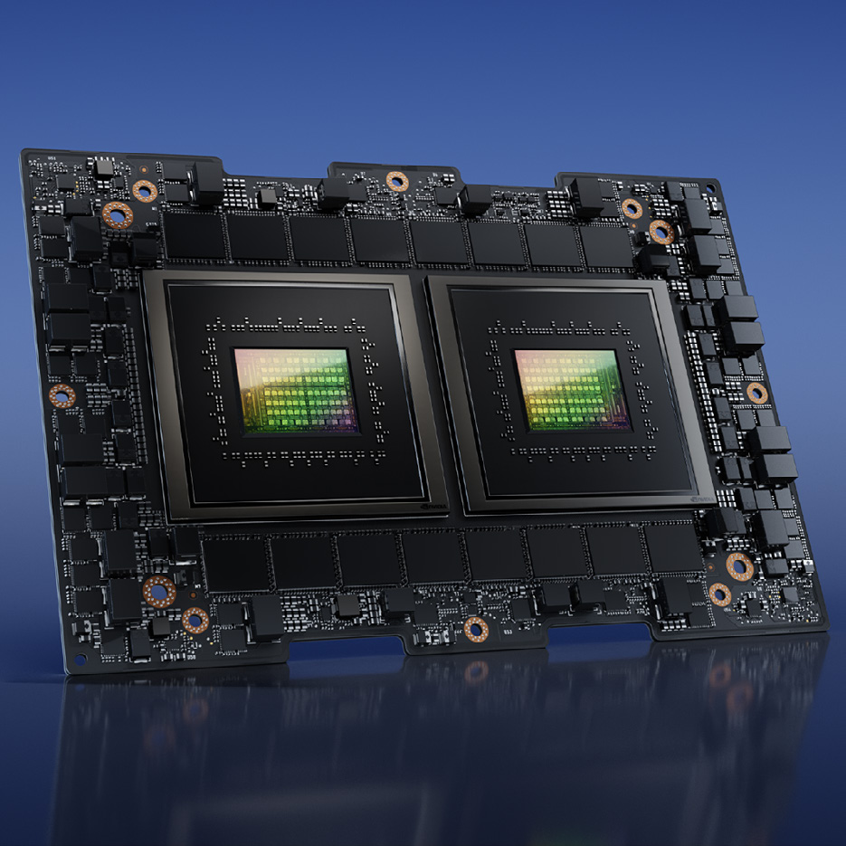
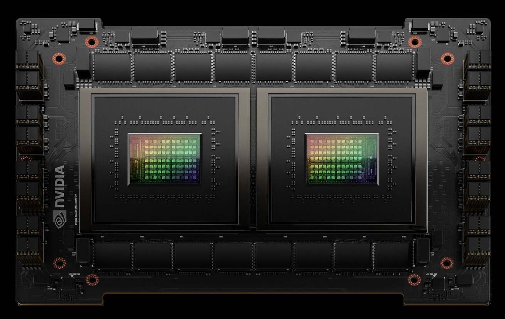
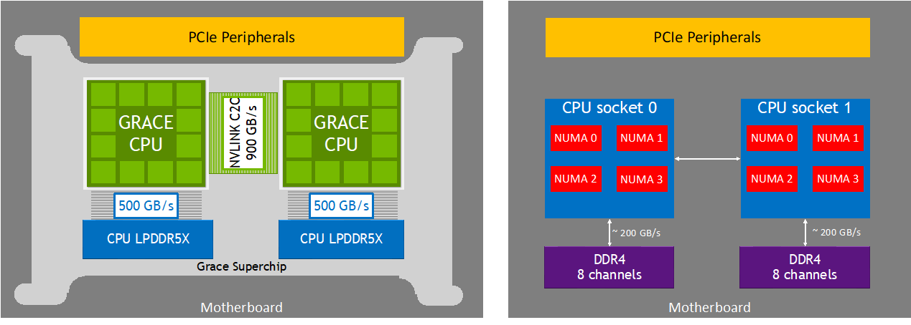
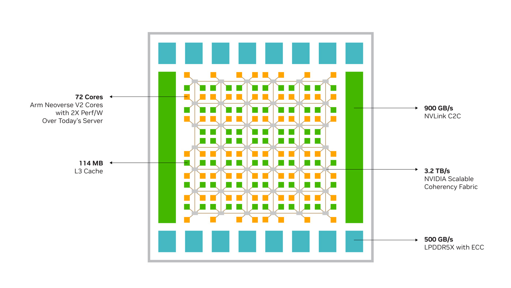
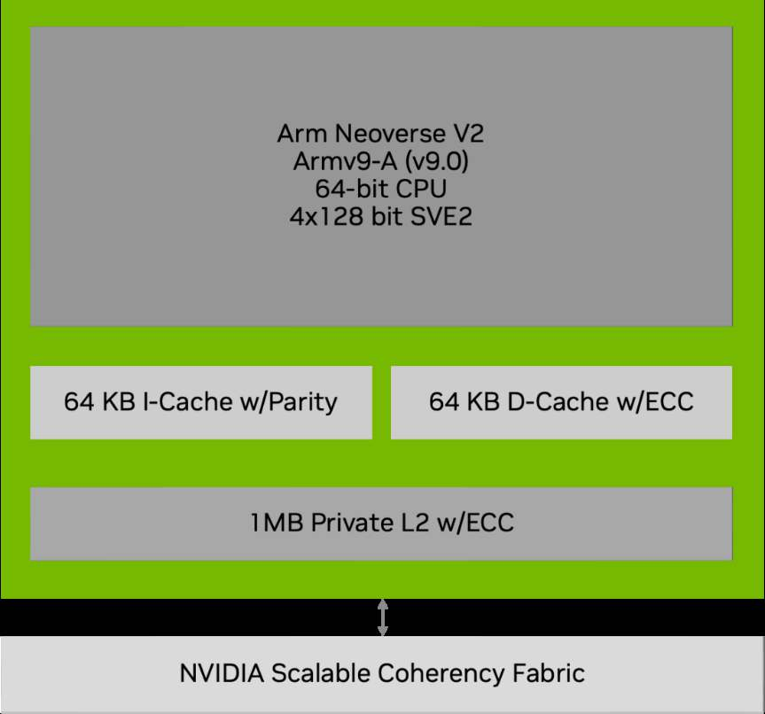

**Understanding the NVIDIA Grace CPU Superchip**

Welcome! As you start submitting jobs, it helps to understand the hardware underneath the system. This cluster is
powered by the **NVIDIA Grace CPU Superchip**.

This architecture is designed for high-performance computing (HPC), cloud, and enterprise workloads, with particular
emphasis on memory bandwidth, power efficiency, and a relatively simple NUMA layout.

## **The Big Picture: What Is a “Superchip”?**

The NVIDIA Grace CPU Superchip combines **two NVIDIA Grace CPUs** in a single compact module.

<figure>


<figcaption aria-hidden="true">

The NVIDIA Grace CPU Superchip module, with two Grace CPUs co-packaged on a single board.
</figcaption>

</figure>

- **The cores:** Across the Superchip, you have **144 Arm Neoverse V2 cores** total, with **72 cores per Grace CPU**.
- **The interconnect:** The two CPUs are connected with **NVLink-C2C (Chip-to-Chip)**, which provides **900 GB/s of
  bidirectional bandwidth** between them.

<figure>


<figcaption aria-hidden="true">

A closer view of the two Grace CPU dies and surrounding LPDDR5X memory packages.
</figcaption>

</figure>

## **Topology and the NUMA Layout**

Compared with many conventional dual-socket server designs, Grace presents a simpler topology to software.

<figure>


<figcaption aria-hidden="true">

Left: the Grace CPU Superchip with two Grace CPUs linked by NVLink-C2C at 900 GB/s, each with its own LPDDR5X memory at
500 GB/s, forming just two NUMA nodes. Right: a conventional dual-socket system for comparison, with multiple NUMA nodes
per socket and DDR4 memory channels.
</figcaption>

</figure>

- **The Scalable Coherency Fabric (SCF):** Within each 72-core Grace CPU, cores, distributed cache, memory, and system
  I/O are connected by the **NVIDIA Scalable Coherency Fabric (SCF)**, which NVIDIA describes as a **high-bandwidth mesh
  interconnect**.
- **Per-CPU NUMA behavior:** A single Grace CPU is presented as **one NUMA node**.
- **Superchip NUMA behavior:** Across the full Grace CPU Superchip, there are **two NUMA nodes total**, one for each
  Grace CPU.
- **Why this matters:** The high-bandwidth **NVLink-C2C** link between the two CPUs helps reduce the cross-socket
  bottlenecks commonly associated with traditional dual-socket systems.

<figure>


<figcaption aria-hidden="true">

A single Grace CPU die: 72 Arm Neoverse V2 cores, 114 MB of L3 cache, 3.2 TB/s NVIDIA Scalable Coherency Fabric, 500
GB/s LPDDR5X with ECC, and the 900 GB/s NVLink-C2C link to the neighbouring CPU.
</figcaption>

</figure>

## **Memory Subsystem**

Grace is built around server-class **LPDDR5X with ECC**, co-packaged with the CPU.

- This Superchip is the **240 GB** configuration, giving **240 GB of on-module LPDDR5X** in total.
- The layout is **2 × 120 GB**, one **120 GB NUMA node per Grace CPU**. NVIDIA’s public documents do **not** state this
  as an explicit NUMA map, but it follows directly from the per-CPU and per-Superchip capacity options they publish.
- At this capacity, NVIDIA lists **up to 512 GB/s per Grace CPU** and **up to 1024 GB/s per Grace CPU Superchip**, which
  the whitepaper summarizes as **up to 1 TB/s raw memory bandwidth**.

This memory design is a major part of Grace’s value proposition: high bandwidth with strong power efficiency. In
practice, treat the machine as **two NUMA nodes with roughly 120 GB attached to each node**.

## **Vectorization: How It Crunches Numbers**

To get maximum performance from HPC applications, vectorization matters.

<figure>


<figcaption aria-hidden="true">

Inside a single Arm Neoverse V2 core: an Armv9-A 64-bit CPU with 4×128-bit SVE2 SIMD units, 64 KB L1 I-cache with parity
and 64 KB L1 D-cache with ECC, and 1 MB of private L2 cache with ECC connecting to the NVIDIA Scalable Coherency Fabric.
</figcaption>

</figure>

- **The vector units:** Each Neoverse V2 core has **four 128-bit SIMD units**.
- **The instruction sets:** These units support both **NEON** and **SVE2 (Scalable Vector Extension 2)**.
- **Compiling:** For best performance, compile for the **Armv9-A ISA** and tune for the **Neoverse V2**
  microarchitecture. NVIDIA specifically calls out support from compilers such as **GCC, LLVM, NVHPC, Arm Compiler for
  Linux, and HPE Cray Compilers**.

## **Calculating FLOPS (Floating-Point Operations Per Second)**

NVIDIA lists the Grace CPU Superchip at **7.1 TFLOPS FP64 peak**. Here is the standard back-of-the-envelope calculation
for theoretical FP64 throughput.

**Per-core FP64 math:**

1.  **Vector length:** 128 bits\
2.  **FP64 element size:** 64 bits, so each 128-bit vector holds **2 FP64 elements**\
3.  **Functional units:** **4** per core\
4.  **FMA:** A fused multiply-add counts as **2 floating-point operations per element**

Using the usual peak-throughput calculation:

``` math
\text{FLOPS/cycle per core} = (\text{elements per vector}) \times (\text{vector units}) \times (\text{operations per FMA})
```

``` math
\text{FLOPS/cycle per core} = 2 \times 4 \times 2 = 16
```

So, each core can theoretically deliver **16 FP64 operations per cycle** when fully utilizing FMA.

**Total Superchip performance at all-core SIMD frequency:**

``` math
\text{Total FP64 Peak} = 144 \times 3.0 \times 10^9 \times 16
```

``` math
\text{Total FP64 Peak} \approx 6.91 \text{ TFLOPS}
```

NVIDIA’s published **7.1 TFLOPS** figure is consistent with using the **3.1 GHz base frequency** rather than the **3.0
GHz all-core SIMD frequency**:

``` math
144 \times 3.1 \times 10^9 \times 16 \approx 7.14 \text{ TFLOPS}
```

## **Summary for Users**

The Grace CPU Superchip gives you:

- **144 Arm Neoverse V2 cores**
- **2 NUMA nodes total**
- **900 GB/s NVLink-C2C** between the two CPUs
- **240 GB LPDDR5X with ECC**
- **Up to 1 TB/s raw memory bandwidth**
- **SVE2-capable SIMD units** for highly vectorized workloads

In practice, that means a platform designed to be easier to optimize than many conventional dual-socket systems,
especially for memory-bandwidth-sensitive HPC applications.
